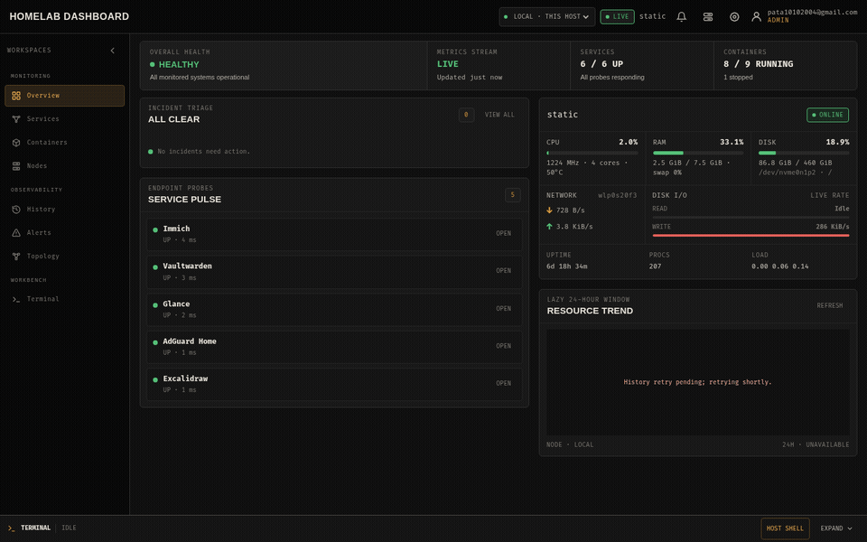
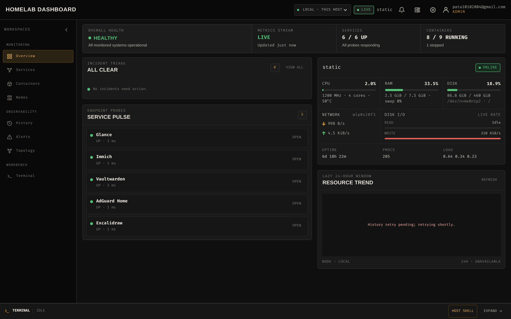
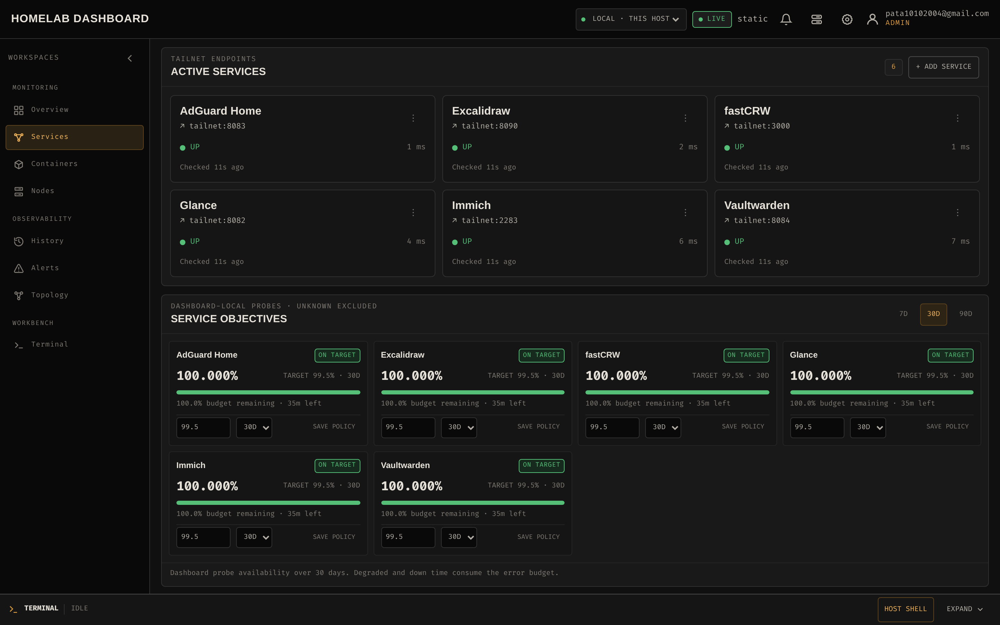
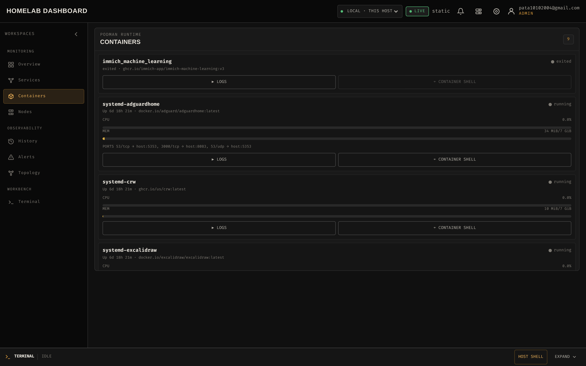
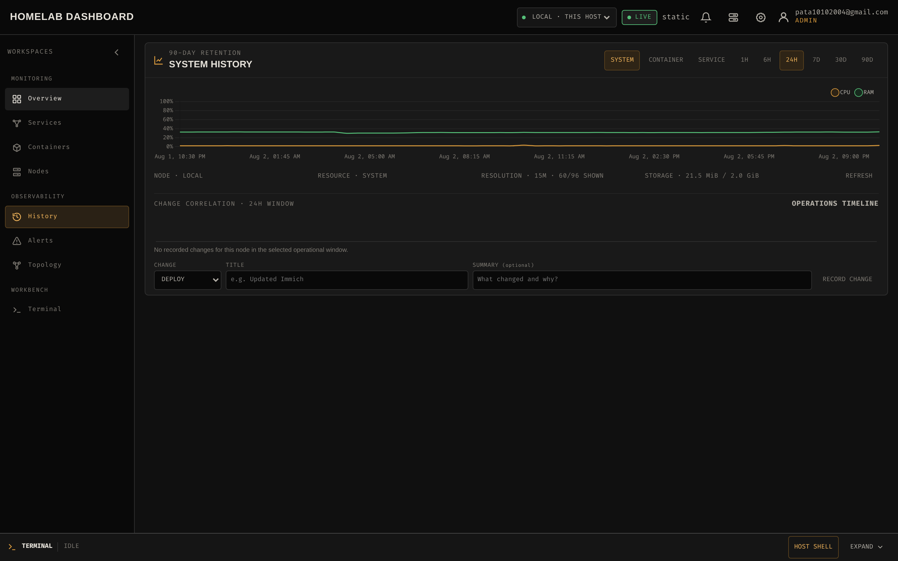
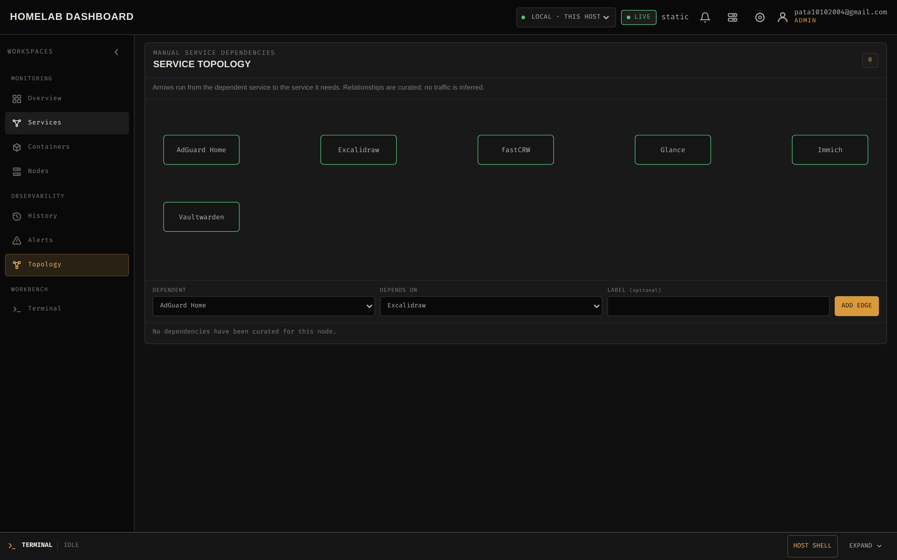
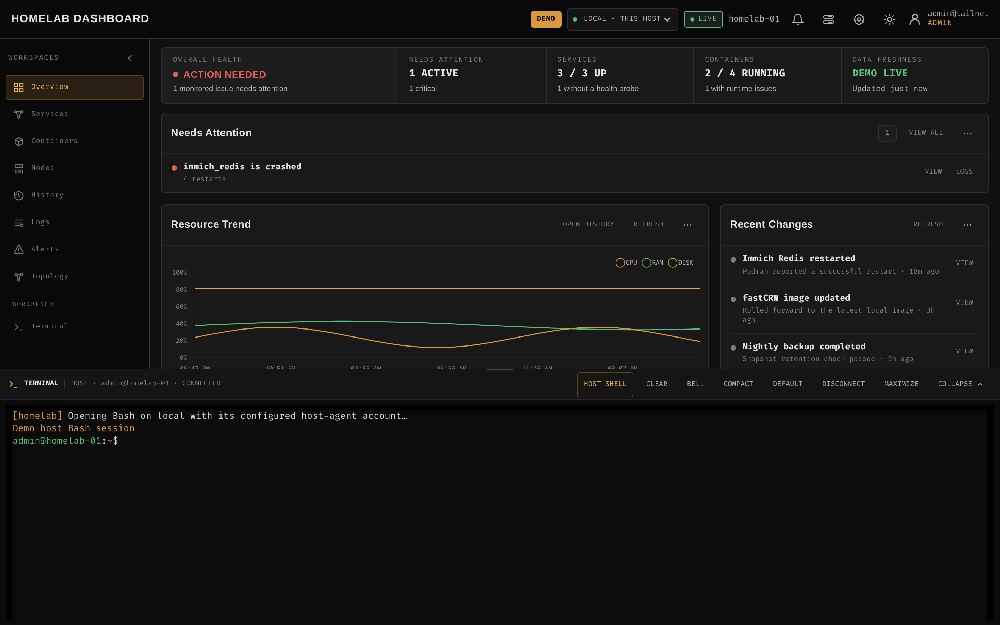
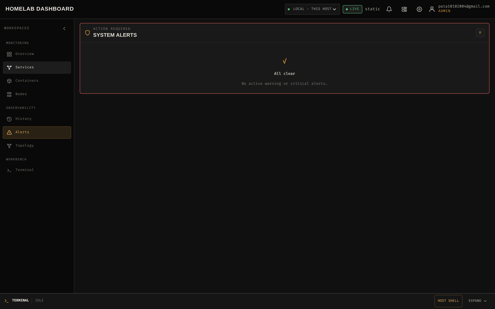

<h1 align="center">HomeLab Dashboard</h1>

<p align="center"><strong>A Tailscale-only operations console for 1–5 rootless Podman homelab nodes: observe services and backup freshness, then open the correct container or host shell — no inbound ports, no monitoring stack.</strong></p>

<p align="center"><code>Go</code> · <code>SQLite</code> · <code>Podman</code> · <code>Tailscale</code> · <code>WebSocket</code> · <code>Vanilla JS</code></p>

<p align="center">
  <a href="https://github.com/bnhminh1010/homelab-dashboard/blob/main/LICENSE"></a>
  <a href="https://github.com/bnhminh1010/homelab-dashboard/releases"></a>
  <a href="https://github.com/bnhminh1010/homelab-dashboard/actions"></a>
  <a href="https://github.com/bnhminh1010/homelab-dashboard"></a>
</p>

<p align="center"><sub>Three static Go binaries. No Node.js. No npm. No CDN runtime dependencies.</sub></p>

<p align="center">
  <a href="#quick-start-with-podman-compose">Quick start</a> · <a href="#packages">Packages</a> · <a href="#centralized-container-logs-optional">Logging</a> · <a href="#architecture-and-data-lifecycle">Architecture</a> · <a href="#security-boundary">Security</a> · <a href="#operations-and-troubleshooting">Operations</a> · <a href="#development-and-verification">Development</a>
</p>

<p align="center"><a href="https://bnhminh1010.github.io/HomeLab-Dashboard/">Open the public demo</a> · <a href="https://github.com/bnhminh1010/HomeLab-Dashboard/releases">Download a release</a></p>

<p align="center"></p>

> [!NOTE]
> This is an intentionally small operations console for 1–5 nodes—not a
> replacement for Grafana, Prometheus, Loki, or an enterprise control plane.
> It favors direct visibility and safe everyday action on a personal homelab.

| Observe | Act | Retain | Trust |
|---|---|---|---|
| Host, services, containers, TLS, backups and up to five nodes | Logs, container shells and explicitly confirmed host Bash | Tiered metrics, SLOs, alerts and operational events for up to 90 days | Tailscale identity, viewer/admin roles, CSRF and same-origin mutation guards |

## Screenshots



| Services with SLO error budgets | Container inventory with logs & shells |
|---|---|
|  |  |

| 90-day history and operations timeline | Service dependency topology |
|---|---|
|  |  |

| Host shell inside the console | Alert center with ack/silence |
|---|---|
|  |  |

## Why this is different

Not a bookmark grid, not a Grafana stack, not a generic "works with Tailscale"
project. It focuses on one loop homelab operators actually run: *see a problem,
understand it, act on it safely.*

| Compared to | This dashboard |
|---|---|
| Start pages (Homepage, Homarr, Dashy) | Real host/container/service state, not link tiles |
| Monitors (Beszel, Netdata, Uptime Kuma) | First-party SLOs, backup freshness, and a shell to act on findings |
| Admin consoles (Cockpit, Portainer) | 1–5 nodes, rootless Podman-first, no inbound agent port |
| Browser terminals (ttyd, WeTTY) | Identity-aware, context-linked terminal inside the ops console |

Key differentiators, each implemented in code (see `internal/`):

- **No inbound agent port.** Local host access runs through a Unix-socket host
  agent; remote nodes dial out over Tailscale HTTPS/WSS. No SSH, agent listener,
  or reverse proxy to secure on any node.
- **Tailscale identity is the auth plane.** Viewer/admin roles come from Tailnet
  identity, sessions and mutations are CSRF/`SameSite` guarded, and identity
  headers are trusted only from loopback.
- **Operate, not just observe.** Container shells and an explicitly confirmed
  host Bash login are context-linked to the alert, log or metric that sent you
  there.
- **Bounded operational memory.** Tiered 1h–90d SQLite history with a visible
  quota and an archived-resource picker — no Prometheus required.
- **Backup freshness and SLO error budgets** without owning backup credentials
  or running a metrics stack.

## Capabilities

### See the state of the lab

- Live CPU, memory, disk, network, load, uptime, temperature and process
  metrics; rootless Podman health and resource usage; and a graphite workbench
  that adapts from desktop to mobile.
- Tiered SQLite history for host, container and service uptime across
  **1 hour–90 days**, including an archived-resource picker and a visible
  storage-quota state.
- Local and remote fleet capacity, HTTPS certificate observations, backup
  freshness, manually curated service dependencies and a 90-day change
  timeline with markers aligned to the selected history window.
- Per-service availability objectives with 7/30/90-day windows and an explicit
  error budget once probe observations exist.

### Respond without leaving the dashboard

- Persistent service shortcuts with SSRF-safe HTTP/HTTPS or TCP probes, read-only container logs
  with follow/pause/search/download, and admin-only interactive container
  shells in xterm.js.
- An explicitly confirmed Bash login shell on the selected host. It requires an
  admin identity, the dedicated host-shell allowlist and a visible confirmation;
  local sessions use a Unix-socket host agent while remote sessions use an
  outbound node agent.
- Stateful alert rules for node availability, host resources, services,
  containers and backup freshness. Incidents can be acknowledged or silenced
  for 1, 6 or 24 hours.
- Optional ntfy delivery for firing and resolved alerts, with cooldowns,
  retries, superseded-delivery handling and an admin test push.

### Keep configuration and access deliberate

- One local node plus up to four remote Linux/Podman nodes, connected outbound
  over Tailscale HTTPS/WSS—no inbound agent port.
- Versioned, secret-free export/import with merge/replace previews and a
  revision/`If-Match` guard against stale writes.
- Viewer/admin authorization from Tailscale identity, same-origin and CSRF
  checks for mutations, plus bounded audit history.

There is **no Node.js toolchain**: no npm, package manifest, bundler, CDN or
runtime download. xterm.js, FitAddon and Chart.js are versioned browser bundles
under `static/lib/` and embedded with `go:embed`. The repository `.gitattributes`
marks that directory as `linguist-vendored`, so GitHub language statistics do
not mistake the local browser dependencies for application JavaScript.

## Architecture and data lifecycle

```text
Tailnet browser
      │ HTTPS / WSS (Tailscale Serve)
      ▼
┌───────────────────────────────────────────────────────┐
│ Dashboard container                                   │
│ Go API + WebSocket + embedded static UI + SQLite       │
└───────┬─────────────────────┬─────────────────────┬───┘
        │                     │                     │
        ▼                     ▼                     ▼
  Podman socket         Host-agent PTY       Tailscale WSS
  containers/logs       local Bash           remote node agents
                                                    │
                                                    ▼
                                            Podman + host metrics
```

The dashboard has no published host port. Tailscale Serve terminates the
tailnet HTTPS/WSS connection, while the Go process listens only on loopback in
the shared network namespace. Remote agents always dial out to the dashboard.

The dashboard collects the local node every 2 seconds. A monitoring pipeline
writes host samples every 10 seconds, container samples every 30 seconds and
service observations every minute. Remote node agents send host/container
snapshots and heartbeats every 10 seconds.

History is rolled up and retained in tiers:

| Data | Raw | Intermediate | Long-term |
|---|---:|---:|---:|
| Host | 10 s for 48 h | 1 min for 30 d | 15 min for 90 d |
| Container | 30 s for 48 h | 5 min for 30 d | 1 h for 90 d |
| Service uptime | transitions | hourly uptime buckets | 90 d |

The history resource picker combines the live inventory with retained
container instances and service series, so a resource can still be selected
after it disappears from the current snapshot. Catalog queries are bounded to
the 500 most recently seen entries per resource type for the selected node.

`HISTORY_QUOTA_BYTES` defaults to 2 GiB and accepts values from 64 MiB through
16 GiB. At 80% the UI reports a warning. At 100%, new raw host/container
history is paused while live metrics, alert evaluation and service transition
recording continue. Retention and rollups run at startup and every minute;
operational cleanup runs at startup and daily. Alert events, resolved alert
states and audit records are retained for 90 days, completed notification
deliveries for 30 days, and active incidents/queued delivery work are preserved.

The latest TLS certificate observation is refreshed at startup and every 12
hours for each configured HTTPS service. It shares the service-probe CIDR
allowlist and optional Tailscale SOCKS route, so the certificate feature cannot
be used as a separate network scanner. A backup job may optionally write a
small status JSON file; the dashboard keeps only its newest status per job and
evaluates its configured freshness interval.

The SQLite database and Tailscale node state live in named volumes and survive
a Compose recreate. History is local to this dashboard instance; it is not a
Prometheus-compatible long-term archive.

Metrics frames that exceed their transport budget identify the omitted source
lists explicitly. The UI displays a visible **PARTIAL** chip and degrades the
overview instead of treating an incomplete inventory as healthy. The monitoring
pipeline treats each truncated source as stale, so omitted resources do not
produce false history or false alert recovery.

Embedded assets use content ETags. Stable local vendor URLs under `/lib/` have
a one-day cache lifetime with `must-revalidate`; application assets use a
one-hour revalidation window. This keeps repeat loads small while ensuring a
browser revalidates the committed vendor bundles after an upgrade.

## Quick start with a release image and Podman Compose

Prerequisites: Linux with systemd and `/bin/bash`, rootless Podman, a Compose
provider (`podman-compose` or the Docker Compose plugin), and a tailnet with
MagicDNS and HTTPS certificates enabled. From the first container-enabled
release onward, each `v*` tag publishes the same multi-architecture
(`linux/amd64`, `linux/arm64`) dashboard image to GitHub Container Registry and
Docker Hub. GitHub Container Registry is the canonical image source:

```text
ghcr.io/bnhminh1010/homelab-dashboard:<release-tag>
```

The Docker Hub mirror is named
`docker.io/minhtuyetvoi/homelab-dashboard:<release-tag>`. Beta tags publish
only their exact version and a `sha-<commit>` tag. Releases before `v1.0.0`
also publish only exact version tags. Stable `v1+` releases additionally publish
`v<major>.<minor>`, `v<major>`, and `latest`; production hosts should always
use the exact version tag.

### One-command installer

For a supported Linux host, the release installer downloads and verifies the
source bundle, preserves an existing `.env`, enables the rootless Podman
socket, installs the host agent, and starts Compose. Run it as the unprivileged
Podman account (never as root):

```bash
curl -fsSL https://github.com/bnhminh1010/HomeLab-Dashboard/releases/latest/download/install.sh | bash
```

The installer prompts for `TS_AUTHKEY` and `ADMIN_USERS` when they are not
already exported. For automation, provide them in the environment and pin an
exact release:

```bash
TS_AUTHKEY=tskey-auth-... \
ADMIN_USERS=alice@example.com \
  bash install.sh --version vX.Y.Z --non-interactive
```

Use `--dry-run` to validate the host without changing it. The installer
supports APT, DNF and Pacman hosts; other distributions should install the
required Podman/systemd dependencies manually first.

Clone the configuration for the release you intend to run, enable the user
socket, and make sure the runtime directory belongs to the account that owns
Podman:

```bash
git clone https://github.com/bnhminh1010/HomeLab-Dashboard.git homelab-dashboard
cd homelab-dashboard
# Replace vX.Y.Z with an available container-enabled GitHub Release tag.
export RELEASE_TAG=vX.Y.Z
git checkout "$RELEASE_TAG"
systemctl --user enable --now podman.socket
export XDG_RUNTIME_DIR="${XDG_RUNTIME_DIR:-/run/user/$(id -u)}"
test -S "$XDG_RUNTIME_DIR/podman/podman.sock"
cp .env.example .env
chmod 600 .env
```

Edit `.env`, set `XDG_RUNTIME_DIR` to the value printed by
`echo "$XDG_RUNTIME_DIR"`, set `TS_AUTHKEY`, and list the exact comma-separated
Tailscale login names allowed to administer the dashboard in `ADMIN_USERS`.
Set `DASHBOARD_IMAGE` to the exact release image. Replace `vX.Y.Z` with a
container-enabled tag shown on GitHub:

```dotenv
DASHBOARD_IMAGE=ghcr.io/bnhminh1010/homelab-dashboard:vX.Y.Z
```

Then validate, pull, and start the project:

```bash
podman compose config
podman compose pull dashboard
podman compose up -d
podman compose ps
```

If the GitHub Container Registry package is private, authenticate with a
GitHub personal access token that has `read:packages` before the pull. Once the
package is made public, no registry login is required. The release workflow
also publishes provenance and an SBOM alongside the image; inspect the manifest
before a sensitive deployment with:

```bash
podman manifest inspect "ghcr.io/bnhminh1010/homelab-dashboard:$RELEASE_TAG"
```

For the first container release, a maintainer must set the new GHCR package and
the Docker Hub repository to **Public** in their respective package settings.

## Packages

<p>
  <a href="https://github.com/bnhminh1010/HomeLab-Dashboard/releases/latest"></a>
  <a href="https://github.com/bnhminh1010/HomeLab-Dashboard/blob/main/LICENSE"></a>
  <a href="https://ghcr.io/bnhminh1010/homelab-dashboard"></a>
  <a href="https://hub.docker.com/r/minhtuyetvoi/homelab-dashboard"></a>
</p>

| Registry | Image | Architectures | Tag policy | Production use |
|---|---|---|---|---|
| [GitHub Container Registry](https://ghcr.io/bnhminh1010/homelab-dashboard) | `ghcr.io/bnhminh1010/homelab-dashboard` | `linux/amd64`, `linux/arm64` | Exact semver and `sha-<commit>`; stable v1+ also publish `v<major>.<minor>`, `v<major>`, `latest` | `DASHBOARD_IMAGE=ghcr.io/bnhminh1010/homelab-dashboard:vX.Y.Z` |
| [Docker Hub](https://hub.docker.com/r/minhtuyetvoi/homelab-dashboard) | `docker.io/minhtuyetvoi/homelab-dashboard` | `linux/amd64`, `linux/arm64` | Mirrors GHCR | `DASHBOARD_IMAGE=docker.io/minhtuyetvoi/homelab-dashboard:vX.Y.Z` |

Use an exact release tag in production. Beta and pre-v1 tags publish only their
exact version plus a commit-SHA tag; never deploy `latest`.

### Local development image

`compose.yml` intentionally never builds source code. For local development,
apply the companion override, which builds `homelab-dashboard:dev` from the
checked-out `Containerfile`:

```bash
podman compose -f compose.yml -f compose.dev.yml config
podman compose -f compose.yml -f compose.dev.yml up -d --build
```

> [!IMPORTANT]
> Do not publish the dashboard directly on `0.0.0.0` while
> `TRUST_TAILSCALE_HEADERS=true`. Compose deliberately exposes no host port;
> access it through Tailscale Serve instead.

The Compose project publishes no host port. Open
`https://homelab-dashboard.<your-tailnet>.ts.net` (or the hostname selected in
`TS_HOSTNAME`) from a device in the same tailnet. Tailscale Serve terminates
HTTPS/WSS and supplies the identity headers used by the dashboard.

Service probe URLs may use RFC1918, CGNAT/Tailnet or ULA addresses from the
configured allowlist. With userspace Tailscale, validated Tailnet IPs are
routed through the local SOCKS5 listener. A MagicDNS probe hostname must also
resolve inside the dashboard container.

### Local host Bash

Host Bash cannot provide normal host behavior from inside the read-only
dashboard container. A small Go agent therefore runs as the current Unix user
and exposes a protected PTY protocol over
`$XDG_RUNTIME_DIR/homelab-dashboard/agent.sock`.

Install or update it with Podman; the host does not need Go, Node.js or npm:

```bash
./deploy/host-agent/install.sh
systemctl --user status homelab-host-agent.service
```

Set `HOST_SHELL_ENABLED=true` and list allowed Tailscale logins in
`HOST_SHELL_USERS`. Every host-shell login must also appear in `ADMIN_USERS`,
otherwise startup fails. Recreate the dashboard after changing these values:

```bash
podman compose pull dashboard
podman compose up -d --force-recreate dashboard
```

Run the installer again after pulling a revision that changes the host agent.
If it must survive logouts, an administrator may run
`loginctl enable-linger "$USER"` once.

### ntfy notifications

Alert evaluation and the in-dashboard incident list work even when ntfy is
disabled. To enable delivery, set the URL and topic together:

```dotenv
NTFY_URL=https://ntfy.sh
NTFY_TOPIC=my-private-homelab-topic
```

For a protected topic, create a host file readable only by the Podman account
and point `NTFY_TOKEN_FILE` at its absolute path:

```bash
install -d -m 0700 "$HOME/.config/homelab-dashboard"
install -m 0600 /dev/null "$HOME/.config/homelab-dashboard/ntfy-token"
# Write the token into the file without committing it.
```

```dotenv
NTFY_TOKEN_FILE=/home/you/.config/homelab-dashboard/ntfy-token
```

Leave `NTFY_TOKEN_FILE` empty for anonymous delivery. The Compose file mounts
the configured token at a fixed read-only path; the token is never exported in
dashboard configuration. After recreating the dashboard, use **Settings → ntfy
delivery → Test push** as an administrator.

### Generic webhook notifications

P2 also supports an operator-owned webhook without adding a provider SDK. The
dashboard sends a versioned JSON alert payload with `X-Homelab-Event` and an
`X-Homelab-Signature: sha256=<hex>` HMAC-SHA256 header. Configure the endpoint
and a host-side secret file together:

```bash
install -d -m 0700 "$HOME/.config/homelab-dashboard"
printf '%s' 'replace-with-a-random-secret-at-least-16-bytes' > "$HOME/.config/homelab-dashboard/webhook-secret"
chmod 600 "$HOME/.config/homelab-dashboard/webhook-secret"
```

```dotenv
WEBHOOK_URL=https://automation.example.net/hooks/homelab
WEBHOOK_SECRET_FILE=/home/you/.config/homelab-dashboard/webhook-secret
```

The endpoint must be an absolute HTTP(S) URL without credentials, query or
fragment. The secret is mounted read-only and is never exposed through the API
or dashboard configuration export. **Alerts → Webhook delivery → Test POST**
verifies the configured destination. If both ntfy and webhook are configured,
alerts are fanned out to both providers.

### Centralized container logs (optional)

The built-in log viewer always reads live `stdout`/`stderr` from Podman. For
local historical search, enable the optional **Loki + Vector** overlay. Vector
reads the existing rootless Podman Docker-compatible socket and writes only to
Loki; the dashboard queries Loki through its internal Compose URL. It does not
replace application logging, nor does it collect remote-node logs in v1.

The overlay has no published host ports. Loki and Vector share an internal
Compose network with the Tailscale container; Tailscale Serve does not expose
Loki. Loki is configured for seven-day retention in the `loki-data` named
volume; compaction applies deletion asynchronously.
Start it explicitly after the base dashboard is healthy:

```bash
podman compose -f compose.yml -f compose.logging.yml config
podman compose -f compose.yml -f compose.logging.yml up -d
podman compose -f compose.yml -f compose.logging.yml ps
```

Collection is opt-in. Add these labels to each workload whose container logs
may be retained. The second label gives the dashboard a stable service grouping
even if a container is recreated with a new name:

```yaml
services:
  my-service:
    image: example/my-service:1.2.3
    labels:
      io.homelab.dashboard.logs: "enabled"
      io.homelab.dashboard.log.service: "my-service"
```

For a container started outside Compose, use the equivalent labels:

```bash
podman run \
  --label io.homelab.dashboard.logs=enabled \
  --label io.homelab.dashboard.log.service=my-service \
  example/my-service:1.2.3
```

Do not put container IDs, image digests, request IDs, trace IDs, users, URLs
or secrets in the service label: it is a Loki index label. Vector keeps
container ID, name, image and stream as per-entry structured metadata instead.
Applications you own should write newline-delimited JSON to stdout with fields
such as `timestamp`, `level`, `message`, `service`, `request_id` and `trace_id`;
never log credentials, bearer tokens, cookies or authorization headers.

To remove this optional historical store, first stop the overlay, then remove
only its named volumes if the seven-day log history is no longer needed:

```bash
podman compose -f compose.yml -f compose.logging.yml down
podman volume rm homelab-dashboard_loki-data homelab-dashboard_vector-data
```

The Vector socket mount is intentionally powerful: anyone who can modify
`compose.logging.yml` can make requests as the rootless Podman owner. Keep the
repository checkout and `.env` private to that account. If Vector cannot read
the socket, confirm the user service is active and that `XDG_RUNTIME_DIR`
matches the account that owns Podman:

```bash
systemctl --user enable --now podman.socket
test -S "$XDG_RUNTIME_DIR/podman/podman.sock"
podman compose -f compose.yml -f compose.logging.yml logs vector loki
```

### Backup status reports

The dashboard does not run or credential backup software. Any local backup job
can publish its most recent result by atomically replacing a small JSON file on
the host. Set `BACKUP_STATUS_FILE` in `.env` to that host path, then recreate
the dashboard. The Compose file exposes it read-only inside the container.

For a remote node, set `BACKUP_STATUS_FILE=/absolute/path/report.json` in
`~/.config/systemd/user/homelab-node-agent.service.d/backup.conf`, then run
`systemctl --user daemon-reload && systemctl --user restart homelab-node-agent`.
The complete JSON contract and an atomic writer example are in
[`deploy/node-agent/README.md`](deploy/node-agent/README.md#backup-status-reports).

### Add a remote node

The dashboard supports four remote nodes in addition to `local`. A remote node
needs Linux, systemd, `/bin/bash`, rootless Podman and connectivity to the
dashboard's Tailscale HTTPS URL. It opens an outbound connection; no inbound
agent port is exposed.

1. Open **Settings → Enrolled nodes → Create token**. The one-time token expires
   after 10 minutes and is consumed on first successful enrollment.
2. On the remote host, check out the same repository and run the installer as
   the unprivileged account that owns the rootless Podman socket:

   ```bash
   ./deploy/node-agent/install.sh \
     https://homelab-dashboard.<your-tailnet>.ts.net \
     "rack-node-1"
   ```

3. Paste the token when prompted. It is not echoed. The installer builds and
   extracts the static `node-agent-export` binary, writes credentials to
   `~/.config/homelab-node-agent/credentials.json` with mode `0600`, and enables
   `homelab-node-agent.service`.
4. Confirm the node becomes online in the selector and test its metrics, logs
   and shell actions.

The agent reconnects with exponential backoff capped at 30 seconds. Revoking a
node disconnects it, invalidates its credential, removes its active alert
runtime and resets a matching default-node preference to `local`. Full install,
prebuilt-binary and uninstall instructions are in
[`deploy/node-agent/README.md`](deploy/node-agent/README.md).

### Export and import dashboard configuration

Administrators can export one deterministic JSON document from Settings. The
document is limited to 1 MiB and contains only:

- service definitions;
- alert rules;
- service SLO target/window policies and manual service-dependency edges;
- UI preferences; and
- display metadata for nodes that are already enrolled.

It never contains node credentials, enrollment tokens, ntfy tokens, sessions,
history, audit records or alert runtime. Import cannot enroll a node; node
metadata is applied only to an existing node ID. `merge` preserves entries not
present in the file, while `replace` may delete portable services/rules after
the preview shows the exact change set.

Every apply must use the revision returned by preview in `If-Match`. If another
admin or process changes portable configuration between preview and apply, the
API returns `412 Precondition Failed`; preview again before retrying. A missing
revision returns `428 Precondition Required`.

### Update an existing installation

Production installations should run an immutable release image tag. SQLite
migrations run during startup, so export the `dashboard-data` named volume with
your normal Podman backup process before an upgrade if you need a rollback
point.

```bash
# In .env, change DASHBOARD_IMAGE to the next exact vX.Y.Z tag first.
podman compose pull dashboard
podman compose up -d --force-recreate dashboard
podman compose ps
```

To roll back, put the previous exact image tag back in `.env`, pull it, and
recreate the dashboard; do not discard the persistent volume. To develop from
source instead, use `compose.dev.yml` as shown above rather than rebuilding a
production Compose deployment implicitly.

If the pulled revision changes an agent, run the matching installer as the
rootless account that owns the service. It preserves the remote node's existing
credential state, then restarts its user unit.

```bash
# Dashboard host
./deploy/host-agent/install.sh

# Remote node, from its checkout
./deploy/node-agent/install.sh
```

## Security boundary

### Access at a glance

| Actor | Allowed actions |
|---|---|
| **Viewer** | Read metrics, history, alerts and container logs. |
| **Admin** | Mutate services/rules/configuration, acknowledge or silence incidents, manage nodes, open container shells and test ntfy. |
| **Host shell user** | An admin explicitly listed in `HOST_SHELL_USERS`, after an in-UI confirmation. The login shell has the Unix account's normal power. |

Every authenticated Tailnet user can view metrics and container logs. Only
exact login names in `ADMIN_USERS` can mutate configuration, acknowledge or
silence alerts, create/revoke nodes, open Container Shell, test ntfy or import
configuration. Host Bash also requires the explicit host-shell allowlist and a
visible confirmation.

Production trusts Tailscale identity headers only when the dashboard listens
on loopback and the request's immediate peer is loopback. The Compose topology
keeps the dashboard in the Tailscale container's network namespace and does not
publish it directly. Do not expose the binary on `0.0.0.0` while trusting
identity headers.

The mounted rootless Podman socket is as powerful as its Unix owner. The
dashboard therefore hides its protected containers, accepts typed log/exec
operations rather than arbitrary commands, and runs with a read-only
filesystem, dropped capabilities and `no-new-privileges`.

The local host agent and every remote node agent run as the account that
installed their systemd user service, never as root. **Host Shell intentionally
has that account's normal filesystem, network, rootless Podman and optional
`sudo` access.** The remote unit does not use `ProtectSystem`, `PrivateTmp` or
`NoNewPrivileges`, because those controls would make the advertised host login
shell restricted or read-only. A disconnect terminates active streams; host
shells are never resumed automatically.

To immediately disable local host access, set `HOST_SHELL_ENABLED=false`,
recreate the dashboard and optionally stop the local agent:

```bash
systemctl --user disable --now homelab-host-agent.service
```

To remove a remote shell path, revoke that node in Settings and stop or
uninstall its node agent.

## Operations and troubleshooting

Useful commands on the dashboard host:

```bash
podman compose ps
podman compose logs -f tailscale dashboard
systemctl --user status homelab-host-agent.service
journalctl --user -u homelab-host-agent.service -f
test -S "$XDG_RUNTIME_DIR/homelab-dashboard/agent.sock"
```

Useful commands on a remote node:

```bash
systemctl --user status homelab-node-agent.service
journalctl --user -u homelab-node-agent.service -f
systemctl --user restart homelab-node-agent.service
test -S "$XDG_RUNTIME_DIR/podman/podman.sock"
```

Common failure modes:

- **`podman: not found` with a container path prompt** — that is Container
  Shell, so commands run inside that container. Use **Host Shell** when you need
  the host's `podman`, filesystem or user environment.
- **`Unable to reserve a host shell session` on `local`** — verify
  `HOST_SHELL_ENABLED`, that the login is in both allowlists, the host-agent
  service is active, and its Unix socket exists under the same
  `XDG_RUNTIME_DIR` mounted by Compose. Re-run `deploy/host-agent/install.sh`
  after an agent update and inspect its journal.
- **The same error on a remote node** — verify the selected node is online and
  inspect `homelab-node-agent.service`. A revoked or deleted credential must be
  enrolled again; an expired enrollment token cannot be reused.
- **Remote node is offline** — confirm Tailscale DNS/HTTPS from that host,
  system clock accuracy, and the agent journal. The dashboard keeps the last
  known snapshot marked stale while the agent reconnects.
- **History says `RAW PAUSED`** — increase `HISTORY_QUOTA_BYTES` within the
  supported range or allow retention to age out old tiers. Live monitoring and
  alerts continue while raw history is paused.
- **ntfy test fails** — configure URL and topic together, use an absolute token
  file path, confirm file permissions/readability and inspect dashboard logs.
- **Old tab shows offline after a dashboard restart** — the UI normally renews
  its in-memory browser session on reconnect; if the browser blocks cookies or
  storage, reload the page through the Tailscale HTTPS URL.
- **HTTPS, certificate or identity failure** — inspect the Tailscale container
  logs. Never commit the auth key; keep `.env` mode `0600` and revoke an exposed
  key.

## Development and verification

The project uses Go tooling only:

```bash
go mod verify
go vet ./...
go test ./... -count=1
go test -race ./... -count=1
go test -tags=integration ./internal/httpapi -count=1
go test -tags=browser ./tests/browser -count=1
```

### Static UI demo and widget customization

For a frontend-only smoke test, serve the embedded UI assets with Python and
open the explicit demo route:

```bash
python3 -m http.server 8080 --directory static
# open http://127.0.0.1:8080/?demo=1
```

This mode exercises the UI with deterministic demo data. Python's static
server does not implement `/api/v1/session` or preference `PATCH` requests;
`501 Not Implemented` is therefore expected when the demo flag is omitted or
when API writes are tested against that server. Use the Go server (or Podman
Compose) for authenticated persistence and real widget saves. If an older tab
still shows stale controls after a frontend update, unregister the site's
service worker or clear site data and perform a hard reload; the shell cache is
versioned with each UI cache-busting release.

Browser tests use chromedp and a locally installed Chromium/Chrome. Unit tests
use fake Podman/agent Unix sockets and do not touch the real host socket. A
release should also validate `podman compose config`, build the image, and run
an end-to-end smoke test on the target homelab because Tailscale identity,
systemd user services and rootless Podman are host-specific. The GitHub release
workflow performs the Go, browser, CodeQL, vulnerability, multi-architecture
image and Compose checks before it pushes to either registry.

## Contributing and security

Contributions follow [CONTRIBUTING.md](CONTRIBUTING.md). Please report
security issues privately through the process in [SECURITY.md](SECURITY.md),
not in a public issue. This project is licensed under
[Apache-2.0](LICENSE).
